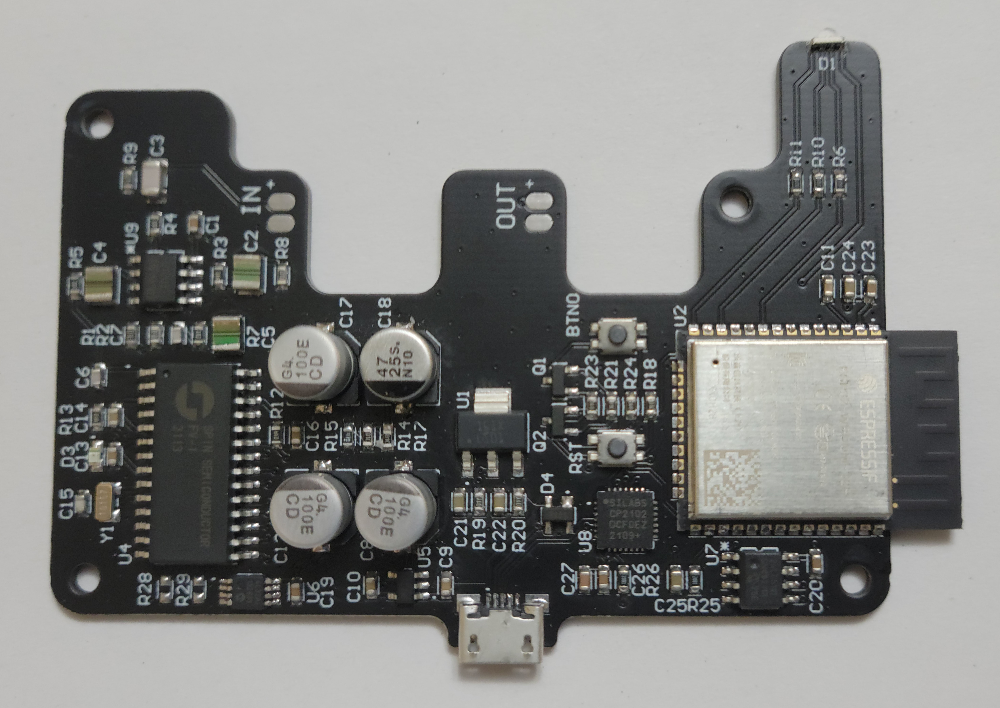

# Multi-Effect
A wireless control multi-effect system for electric guitars    

   

Rev 1.1:   
-The board shape is adjusted from v1.0 to accommodate an optimized mechanical design with off board audio connectors.  
-A RGB status LED is added to communicate wireless connection states.  
   

Rev 1.0:    
-The v1.0 PCB is fully tested and functional.  
   

## About
This is a PCB that I'm developing for a university capstone project. It processes audio effects for electric guitars and is controlled with a wireless [interface](https://github.com/CraigCrundwell/Multi-Effect-Interface)
located on the guitar. More details to come... 
